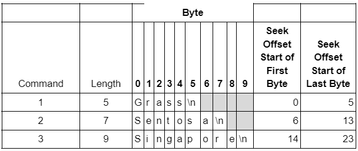

# Assignment Guidance

## Assignment 8 Instruction

The following are guidances to complete Assignment 8 in this Assignment-3 repository.

> Step 4: Add source code, makefile and init scripts needed to install a `/dev/aesdchar` device.  
Ultimately this device should be installed in your `QEMU` instance, however you may also wish to test on your host virtual machine during development.  
Your `/dev/aesdchar` device should use the circular buffer implementation you developed in assignment 7 plus new code you add to your driver to:  
>
> a. Allocate memory for each write command as it is received, supporting any length of write request
(up to the length of memory which can be allocated through `kmalloc`), and saving the write command content within allocated memory.  
>> i. The write command will be terminated with a `\n` character as was done with the aesdsocket application.  
>>> Write operations which do not include a \n character should be saved and appended by future write operations and should not be written to the circular buffer until terminated.  
>>
>> ii. The content for the **most recent 10 write commands** should be saved.  
>> iii. Memory associated with write commands more than 10 writes ago should be freed.  
>> iv. Write position and write file offsets can be ignored on this assignment, each write will just write to the most recent entry in the history buffer or append to any unterminated command.  
>> v. For the purpose of this assignment you can use `kmalloc` for all allocations regardless of size, and assume writes will be small enough to work with kmalloc.
>
> b. Return the content (or partial content) related to the **most recent 10 write commands**, in the order they were received, on any read attempt.  
>> 1(i). You should use the position specified in the read to determine the location and number of bytes to return.  
>> 2(ii). You should honor the count argument by sending only up to the first “count” bytes back of the available bytes remaining.
>
> c. Perform appropriate locking to ensure safe multi-thread and multi-process access and ensure a full write file operation from a thread completes before accepting a new write file operation.  
>
> d. Your implementation should print the expected contents when running the [drivertest.sh](https://github.com/cu-ecen-aeld/assignment-autotest/blob/master/test/assignment8/drivertest.sh) script.

## Assignment 9 Instruction

> Step 3: Update your `aesd-char-driver` implementation in your `assignment 3 and later` repository to add the following features:
>
> a. Add custom seek support to your driver using the `llseek` `file_operations` function.  Your seek implementation should:
>
> i. Support all positional types (`SEEK_SET`, `SEEK_CUR`, and `SEEK_END`) and update the file position accordingly.
>
> 1. For instance, if your driver is storing writes of 5, 7, and 9 bytes each,
> a file position of 0-5 would represent a byte within the first write,
> a file position of 6-13 would represent a byte within the second write,
> and a file position  of 14 through 23 would a byte within represent the 3rd write.
>
> For instance: Consider the content in the table below as handled by your driver, where each string ends with a newline character.
> An offset of 15 would set the pointer to the second byte of the word “Singapore”, byte "i"

```txt
    Grass\n
    Sentosa\n
    Singapore\n
```


